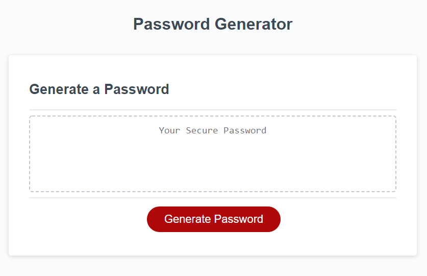

# Challenge 3: Password Generator

## Description

In this project I was assigned to make a password generator that created passwords based on the criteria chosen by the user. My first step was to create each prompt for the user to answer, and then store each chosen string of characters into a variable. Then I created two functions to chose randomly selected characters from each selected list in order to return a randomly generated password. The password is then displayed in the empty text box on the screen. By completing this assignment I was able to understand how the functions and 'for' loop I created were able to create the randomization I needed to generate a password.

## Image

## Link to Deployed Site

<a href=https://pinkywiththebrain.github.io/password-challenge-3/>Password Generator<a>